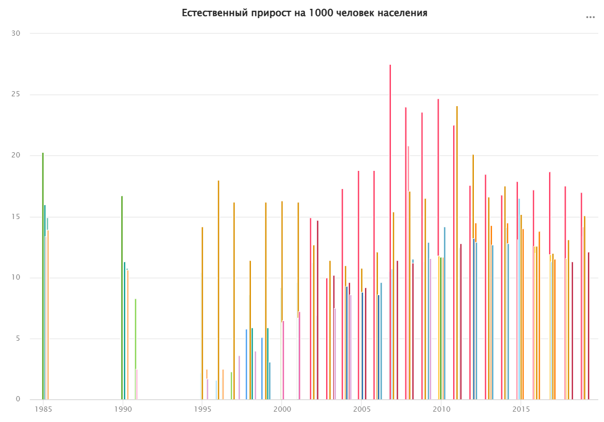
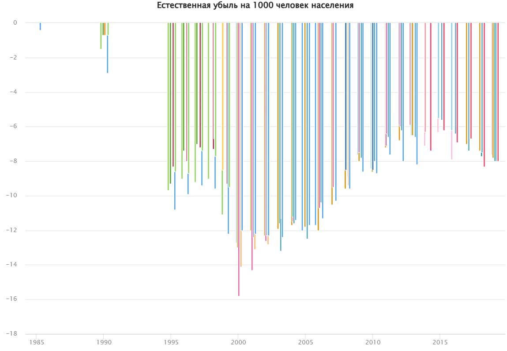
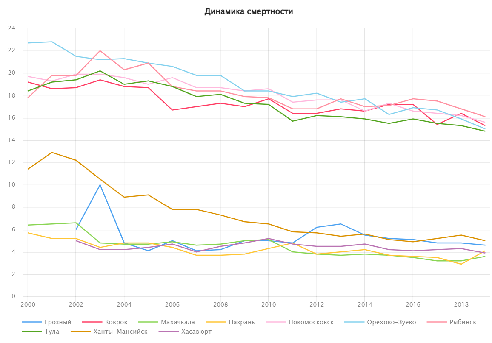
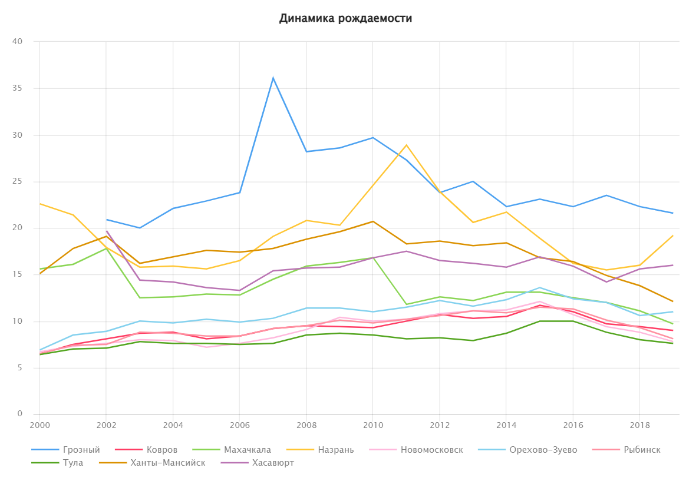
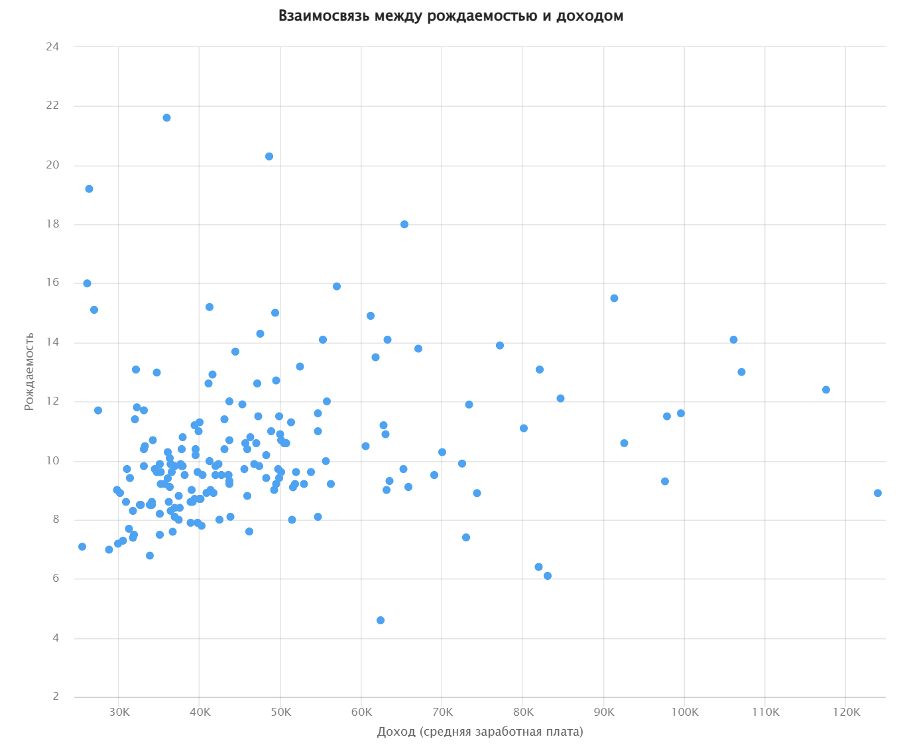

# «Разработка витрины данных для анализа динамики естественного прироста населения городов России»

Целью данной работы является выявление российских городов с наибольшими и наименьшими уровнями естественного прироста населения, исследование динамики рождаемости и смертности, а также построение интерактивного дашборда для визуализации полученных результатов. 

Для достижения цели были поставлены следующие задачи:
* загрузить и подготовить исходные данные, проверить их корректность;
* построить витрину данных для анализа топ-5 городов по приросту и убыли;
* провести сравнение динамики рождаемости и смертности в выделенных группах городов;
* выявить взаимосвязь демографических показателей с социально-экономическими факторами;
* построить интерактивный дашборд в Yandex DataLens.

В данной работе в качестве исходных данных использован датасет «Крупные города России: объединенные данные по основным социально-экономическим показателям за 1985-2019 гг.», в котором содержатся сведения по 70 базовым социально-экономическим показателям для более 200 крупных российских городов за 1985, 1990-1991, 1995-2019 гг. Данные собраны на основе статистических сборников Федеральной службы государственной статистики (Росстата).

## **Загрузка и подготовка данных:**

Для работы с данными была развернута СУБД PostgreSQL в Yandex Cloud (с помощью сервиса Managed Service for PostgreSQL). Датасет был представлен в виде CSV-файла и загружен в базу данных через DBeaver. Импорт данных прошел успешно, однако типы данных преимущественно были определены как строковые (varchar), поэтому типы полей с единицами измерения были изменены на числа с плавающей точкой (float).

Проведены проверки качества исходных данных ([см. папку "sql-queries", "Appendix 1"](./sql-queries/Appendix 1 .sql) в репозитории):

1)	Дубликаты по ключевым полям (город и год) отсутствуют.
2)	Пропущенные значения встречаются менее чем в 5% записей.
3)	Некорректных отрицательных значений в показателях не выявлено.
4)	Выбросы в рождаемости и смертности отсутствуют.

## **Построение витрины данных:**

Основным показателем для анализа является естественный прирост/убыль на 1000 человек населения. Для построения витрины были использованы следующие поля:

* settlement – наименование города,
* year – год,
* rni – естественный прирост/убыль на 1000 человек населения

Было создано представление settlement_top_stats, включающее по каждому году:
	
* топ-5 городов с наибольшим естественным приростом (growth),
* топ-5 городов с наибольшей естественной убылью (decline).

При построении витрины исключались записи с пропусками – с помощью фильтра WHERE rni IS NOT NULL (см. папку "sql-queries", "Appendix 2" в репозитории).

Проведены проверки корректности витрины (см. папку "sql-queries", "Appendix 3" в репозитории):

1)	В витрине только 5 записей на год для каждого типа.
2)	Для типа “decline” действительно отбираются города с отрицательным приростом.
	 
## **Визуализация:**

В Yandex DataLens реализованы:

* столбчатая диаграмма по частоте попадания городов в топ-5 по естественному приросту и убыли за каждый год;
* линейные графики динамики рождаемости и смертности для топ-городов;
* диаграммы рассеяния для анализа связи рождаемости и доходов.

 

**📈 [Открыть интерактивный график в DataLens](https://datalens.ru/wizard/ikwed84z1gja3-barchart-growth)**

 

**📈 [Открыть интерактивный график в DataLens](https://datalens.ru/wizard/jlxff06fuxz44-barchart-decline)**

Визуализация динамики рождаемости и смертности всех 200 городов сложна для восприятия, поэтому были отобраны 5 городов, которые чаще всего попадали в лидеры по приросту, и 5 городов, чаще всего попадавших в лидеры по убыли (см. папку "sql-queries", "Appendix 4" в репозитории).

Выявлены топ 5 городов по приросту:

1.	Назрань (Республика Ингушетия)
2.	Грозный (Чеченская Республика)
3.	Махачкала (Республика Дагестан)
4.	Ханты-Мансийск (Ханты-Мансийский автономный округ-Югра)
5.	Хасавюрт (Республика Дагестан)

Выявлены топ 5 городов по убыли:

1.	Тула (Тульская область)
2.	Новомосковск (Тульская область)
3.	Рыбинск (Ярославская область)
4.	Орехово-Зуево (Московская область)
5.	Ковров (Владимирская область)

### **Смертность (общий коэффициент смертности)**

 

**📈 [Открыть интерактивный график в DataLens](https://datalens.ru/wizard/vyvwo2y2k3oog-linechart-final-project-death)**

По графику видно, что смертность в «группе убыли» стабильно превышает показатели «группы прироста».

 
### **Рождаемость (общий коэффициент рождаемости)**

 

**📈 [Открыть интерактивный график в DataLens](https://datalens.ru/wizard/5899tqtctahcq-linechart-final-project-birth)**

По графику видно, что рождаемость, напротив, выше в «группе прироста» и существенно ниже в «группе убыли».

Разрыв между этими группами по обоим показателям является значительным и устойчивым на протяжении всего анализируемого периода.

### **Взаимосвязь между рождаемостью и доходом**

 

**📈 [Открыть интерактивный график в DataLens](https://datalens.ru/wizard/y1345wmw6xkmj-scatterplot-final-project-wage-birth)**

В рассмотренном 2019 году наблюдается положительная корреляция между рождаемостью и уровнем дохода, но выделяются региональные особенности. Города Северного Кавказа характеризуются высоким уровнем рождаемости и положительным приростом, несмотря на низкие доходы населения. Анадырь напротив, имеет высокие доходы при низкой рождаемости, что объясняется удаленностью и относительно небольшой численностью населения Чукотского АО.

На основе построенных графиков был сформирован **[интерактивный дашборд в DataLens](https://datalens.yandex/dgijssvz2z80y)**

 
## **Заключение**

В ходе работы были реализованы все поставленные задачи: 
	
* загружены и подготовлены исходные данные, проведена проверка их на корректность;
* построена витрина данных для анализа топ-5 городов по приросту и убыли;
* проведено сравнение динамики рождаемости и смертности в группах городов;
* выявлена связь демографических показателей с социально-экономическими факторами (на примере взаимосвязи рождаемости и доходов);
* построен интерактивный дашборд в Yandex DataLens.

Полученные результаты подтверждают наличие выраженных региональных различий в естественном приросте населения:

* Города Северного Кавказа и отдельные города Сибири демонстрируют устойчивый естественный прирост населения, что объясняется высокой рождаемостью. Согласно исследованиям специалистов РАНХиГС и Института социологии РАН, данный феномен в городах Северного Кавказа во многом связан с культурными и религиозными традициями, а также устойчивостью семейных ценностей.
* Города Центральной России характеризуются выраженной естественной убылью, связанной с низкой рождаемостью и высоким удельным весом населения старших возрастов. По данным РЭУ им. Плеханова, демографические тренды в этих регионах носят инерционный характер и сохранятся в долгосрочной перспективе.

Таким образом, демографическая динамика российских городов тесно связана с социально-экономическими и культурными особенностями регионов. 
	
### **Перспективы развития проекта:**

* расширение анализа за счёт дополнительных факторов (уровень образования, миграция, доступность медицины, занятость населения);
* построение регрессионных моделей для оценки влияния социально-экономических характеристик на естественный прирост населения;
* разработка прогностических моделей демографической динамики;
* автоматизация процессов обновления витрины данных с использованием ETL-подхода.

## **Список литературы**

1.	Безвербный, В. А., Микрюков, Н. Ю., Мирязов, Т. Р., Лукашенко, Е. А. Естественное движение населения в российских регионах: факторы, динамика, перспективы // ДЕМИС. Демографические исследования. 2023. Т. 3, № 4. С. 45. //Режим доступа: https://www.demis-journal.ru/index.php/demis/article/download/9070/8909/ [Дата обращения: 29.09.2025]
2.	Крупные города России: объединенные данные по основным социально-экономическим показателям за 1985-2019 гг. // Росстат; обработка: Гостева И., Казанцев К. Инфраструктура научно-исследовательских данных, АНО «ЦПУР», 2021. //Режим доступа: http://data.rcsi.science/data-catalog/datasets/187/ [Дата обращения: 29.09.2025]
3.	Панков И. Почему в регионах Северного Кавказа всплеск рождаемости, а в других – падение. 26.03.2024 //Режим доступа: https://rg.ru/2024/03/26/reg-skfo/pochemu-v-regionah-severnogo-kavkaza-vsplesk-rozhdaemosti-a-v-drugih-padenie.html [Дата обращения: 29.09.2025]
4.	Платонов С. Аналитика в Yandex DataLens за пределами CSV: начало работы с PostgreSQL //Режим доступа: https://yandex.cloud/ru/blog/posts/2022/09/datalens-analytics [Дата обращения: 29.09.2025]
5.	Соловьева О. Жителей промышленных регионов становится все меньше. Естественный прирост населения наблюдается только в 15 субъектах РФ. 12.03.2024 //Режим доступа: https://www.ng.ru/economics/2024-03-12/4_8967_regions.html [Дата обращения: 29.09.2025]. 
